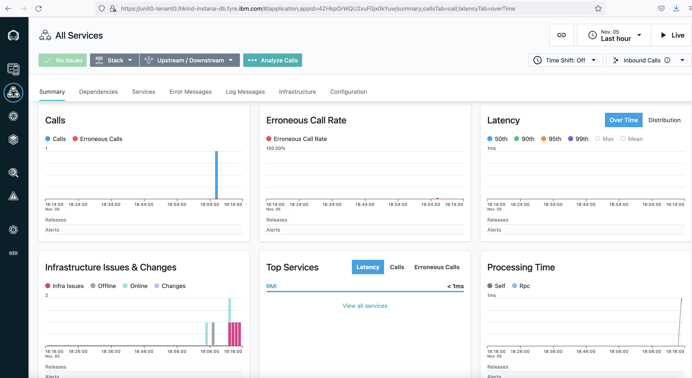

<!-- START doctoc generated TOC please keep comment here to allow auto update -->
<!-- DON'T EDIT THIS SECTION, INSTEAD RE-RUN doctoc TO UPDATE -->
**Table of Contents**  *generated with [DocToc](https://github.com/thlorenz/doctoc)*

- [Setting Operator-based Instana 211 Running on KIND Cluster](#setting-operator-based-instana-211-running-on-kind-cluster)
  - [0. env preparation](#0-env-preparation)
    - [Create a KIND Cluster](#create-a-kind-cluster)
    - [Config NFS Server on `lhkind-instana-db`](#config-nfs-server-on-lhkind-instana-db)
      - [Install NFS Server](#install-nfs-server)
      - [Create a shared folder](#create-a-shared-folder)
      - [Export the shared folder to NFS Server](#export-the-shared-folder-to-nfs-server)
    - [Create a StorageClass for Spans with NFS Server](#create-a-storageclass-for-spans-with-nfs-server)
  - [1. Pre-requisites](#1-pre-requisites)
    - [tool  preparations:](#tool--preparations)
      - [env variables](#env-variables)
      - [Install instana-console](#install-instana-console)
      - [Install instana plugin](#install-instana-plugin)
      - [Instana versions](#instana-versions)
    - [Install Instana DB](#install-instana-db)
      - [Configure db-settings.hcl](#configure-db-settingshcl)
      - [Install DB Containers](#install-db-containers)
      - [Verify all DB Containers are running](#verify-all-db-containers-are-running)
  - [2. Installing the Operator](#2-installing-the-operator)
    - [2.1 Secret for Docker Registry Access](#21-secret-for-docker-registry-access)
    - [2.2 TLS Secrets for Admission Webhook](#22-tls-secrets-for-admission-webhook)
    - [2.3 Applying Manifests Directly](#23-applying-manifests-directly)
    - [2.4 Rendering Manifests Only](#24-rendering-manifests-only)
  - [3. Setting up Instana](#3-setting-up-instana)
    - [3.1 Preparation Steps](#31-preparation-steps)
      - [3.1.1 Creating Namespaces](#311-creating-namespaces)
      - [3.1.2 Creating Secrets](#312-creating-secrets)
        - [3.1.2.1 Secret `instana-registry`](#3121-secret-instana-registry)
        - [3.1.2.2 Secret `instana-base`](#3122-secret-instana-base)
          - [download licence](#download-licence)
          - [create dhparams](#create-dhparams)
          - [Create secret](#create-secret)
        - [3.1.2.3 Secret `instana-service-provider`](#3123-secret-instana-service-provider)
        - [3.1.2.4 Secret `instana-spans`](#3124-secret-instana-spans)
        - [3.1.2.5 Secret `instana-proxy`](#3125-secret-instana-proxy)
        - [3.1.2.6 Secret `instana-tls`](#3126-secret-instana-tls)
        - [3.1.2.7 Secret `instana-smtp`](#3127-secret-instana-smtp)
    - [3.2. Creating a Core](#32-creating-a-core)
    - [3.3 Creating a Unit](#33-creating-a-unit)
  - [4. Ingress](#4-ingress)
      - [4.1 Acceptor](#41-acceptor)
      - [4.2 Core Ingress](#42-core-ingress)
      - [4.3 Unit Ingress](#43-unit-ingress)
  - [5. setup kind network via apache](#5-setup-kind-network-via-apache)
  - [6. Access Instana UI](#6-access-instana-ui)
  - [Supplementary:  reference of  setttings.hcl vs. CR secret/core/unit](#supplementary--reference-of--setttingshcl-vs-cr-secretcoreunit)

<!-- END doctoc generated TOC please keep comment here to allow auto update -->

# Setting Operator-based Instana 211 Running on KIND Cluster

This is a tutorial for how to **Operator-based install 211** and run Instana on [KIND](https://kind.sigs.k8s.io/) Cluster, main steps are referenced https://www.instana.com/docs/release-211/self_hosted_instana_k8s/installation .


## 0. env preparation

Before we start to install instana, we need to prepare the kind k8s cluster.

 For **storageClass**, nfs server and client are used.  You can also use the out-of-box default **`standard`**  storageClass created by kind cluster.


In this tutorial, I will use `lhkind-instana-db.fyre.ibm.com`  VMs for Instana DB and Instana running on KIND.

```console
$ cat /etc/hosts | grep kind
9.112.255.59 lhkind-instana-db lhkind-instana-db.fyre.ibm.com 
```


### Create a KIND Cluster

First we need create a Cluster config for KIND withe one Control Plane and three workers as follows. Please note we are enabling `NodePort` for this KIND cluster for future access of Instana.

```yaml
kind: Cluster
apiVersion: kind.x-k8s.io/v1alpha4
nodes:
  - role: control-plane
    image: kindest/node:v1.21.2
    extraPortMappings:
    - containerPort: 30950
      hostPort: 8600
    - containerPort: 30951
      hostPort: 8601
    - containerPort: 30952
      hostPort: 8080
    - containerPort: 30953
      hostPort: 443
    - containerPort: 30954
      hostPort: 9080
    - containerPort: 30955
      hostPort: 9443
    - containerPort: 30956
      hostPort: 9086
    - containerPort: 30957
      hostPort: 9446
  - role: worker
    image: kindest/node:v1.21.2
  - role: worker
    image: kindest/node:v1.21.2
  - role: worker
    image: kindest/node:v1.21.2
```

Save above file as `cluster.yaml` and run the following command to deploy the KIND cluster:

```console
kind create cluster --config cluster.yaml --name instana
```

After the `kind create` finished, check all nodes are ready:

```console
$ kubectl get nodes
NAME                    STATUS   ROLES                  AGE     VERSION
instana-control-plane   Ready    control-plane,master   2d21h   v1.21.1
instana-worker          Ready    <none>                 2d21h   v1.21.1
instana-worker2         Ready    <none>                 2d21h   v1.21.1
instana-worker3         Ready    <none>                 2d21h   v1.21.1
```


### Config NFS Server on `lhkind-instana-db`

Instana need to store Spans in either S3 or disk, here I do not have a S3 bucket, so I will use a NFS Server instead and the NFS Server will be set up on `lhkind-instana-db`.

#### Install NFS Server

```console
sudo apt-get update 
sudo apt install nfs-kernel-server
```

#### Create a shared folder

```console
mkdir /mnt/nfs_share
chown nobody:nogroup /mnt/nfs_share # no-one is owner 
chmod 777 /mnt/nfs_share # everyone can modify files
```

#### Export the shared folder to NFS Server

Add following to `etc/exports`

```console
/mnt/nfs_share *(rw,sync,no_root_squash,no_all_squash)
```

Export and estart NFS Server.

```console
exportfs -a # making the file share available 
systemctl restart nfs-kernel-server # restarting the NFS kernel
```


### Create a StorageClass for Spans with NFS Server

We have just created an NFS Server in `lhkind-instana-db`, so we need to create a StorageClass for Spans. You need to have `helm` installed on your VM.

```console
$ helm version
version.BuildInfo{Version:"v3.3.3", GitCommit:"55e3ca022e40fe200fbc855938995f40b2a68ce0", GitTreeState:"clean", GoVersion:"go1.14.9"}
```

```console
helm repo add nfs-subdir-external-provisioner https://kubernetes-sigs.github.io/nfs-subdir-external-provisioner/

helm install nfs-subdir-external-provisioner nfs-subdir-external-provisioner/nfs-subdir-external-provisioner  --set nfs.server=lhkind-instana-db.fyre.ibm.com --set nfs.path=/mnt/nfs_share
```

Please make sure update `nfs.server` above to your own NFS Server.

After the above command finished, we can verify if the NFS provisioner is installed and storageclass is created via following command:

```console
$ kubectl get po
NAME                                               READY   STATUS    RESTARTS   AGE
nfs-subdir-external-provisioner-78f47cddc9-lbnds   1/1     Running   0          2d20h
```

```console
$ kubectl get sc
NAME                 PROVISIONER                                     RECLAIMPOLICY   VOLUMEBINDINGMODE      ALLOWVOLUMEEXPANSION   AGE
nfs-client           cluster.local/nfs-subdir-external-provisioner   Delete          Immediate              true                   2d20h
```


## 1. Pre-requisites

### tool  preparations:

- 1 Ubuntu VMs with 16 Core, 64G Memory and 250G Disk that instana and DB running
- VM should have network access to the internet
- The version for different components are as follows:
  - KIND 0.11.1
  
  - Ubuntu 20.04
  
  - Docker 19.03.15
  
  - Kubectl  v1.21.2
  
  - Instana Build 211.1
  
  - Instana DB required : see below

#### env variables

```sh
export INSTANA_DOWNLOAD_KEY=qUMhYJxjSv6uZh2SyqTEnw
export INSTANA_SALES_KEY=pgABSBp_SnqIr5oMD68HoQ
export INSTANA_AGENT_KEY=qUMhYJxjSv6uZh2SyqTEnw

export KUBECTL_VERSION=v1.19.2
       
export INSTANA_HOST=lhkind-instana-db.fyre.ibm.com
```


#### Install instana-console

```console
echo "deb [arch=amd64] https://self-hosted.instana.io/apt generic main" > /etc/apt/sources.list.d/instana-product.list
wget -qO - "https://self-hosted.instana.io/signing_key.gpg" | apt-key add -
apt-get update

LATEST_KUBECTL_MARJOR_VERSION=`apt list -a instana-kubectl -q=0 2>&1 | grep Done -A 1 | grep instana | cut -d' ' -f2 | cut -d'-' -f1`
INSTANA_CONSOLE_VERSION=`apt list -a instana-console -q=2 2>&1 | grep $LATEST_KUBECTL_MARJOR_VERSION | head -n 1 | cut -d' ' -f2`
apt-get install instana-console ${INSTANA_CONSOLE_VERSION}

```


#### Install instana plugin

```console
#  version 211-0 will be installed per current instana 211-1 automatically
apt-get install "instana-kubectl" 

```


#### Instana versions

```console
$ instana version
Instana self-hosted: 211-1 3.211.302-0 (3dfe48b1736cd5ccd97f47c875b2210c711cb9ee)

$ kubectl instana -v
kubectl-instana version 211-0 (commit=14e82aa6acc912c55b48d474eb9acfc81fcdb707, date=2021-10-27T13:29:59Z, image=211-0, branch=release)

Required Database Versions:
  * Cassandra:     3.11.10
  * Clickhouse:    21.3.8.76
  * Cockroach:     21.1.7
  * Elasticsearch: 7.10.2
  * Kafka:         2.7.1
  * Zookeeper:     3.6.3
```


### Install Instana DB 

This section is get from [Instana Database Setup](https://www.instana.com/docs/self_hosted_instana_k8s/single_host_database).

#### Configure db-settings.hcl

This is a template for the `db-setting.hcl`.

```cfg
type      = "single-db"
host_name = "<The-FQDN-of-the-machine-the-datastores-are-installed-on>"

dir {
  metrics    = "/mnt/metrics"  //cassandra data dir
  traces     = "/mnt/traces"   // clickhouse data dir
  data       = "/mnt/data"    // elastic, cockroachdb and kafka data dir
  logs       = "/var/log/instana" //log dir for db's
}

docker_repository {
  base_url = "containers.instana.io"
  username = "_"
  password = "<Your-agent-key>"
}
```

You may want to create `/mnt/metrics`, `/mnt/traces`, `/mnt/data` and `/var/log/instana` directories on `lhkind-instana-db` manually.

Here is the exact `db-setting.hcl` on `lhkind-instana-db`:

```
type      = "single-db"
host_name = "lhkind-instana-db.fyre.ibm.com"

dir {
  metrics    = "/mnt/metrics"  //cassandra data dir
  traces     = "/mnt/traces"   // clickhouse data dir
  data       = "/mnt/data"    // elastic, cockroachdb and kafka data dir
  logs       = "/var/log/instana" //log dir for db's
}

docker_repository {
  base_url = "containers.instana.io"
  username = "_"
  password = "qUMhYJxjSv6uZh2SyqTEnw"
}
```

#### Install DB Containers

```console
instana datastores init -f /path/to/your/db-settings.hcl
```

Here are more commands for `instana datastores` for your reference:

Stop all database containers

```console
instana datastores stop
```

Start all database containers

```console
instana datastores start
```

Update images to the latest version of instana-console

```console
instana datastores update
```

#### Verify all DB Containers are running

After `instana datastores init` finished, you can check the status of all database containers and make sure all DB containers are running.

```console
$ docker ps
CONTAINER ID        IMAGE                                                                 COMMAND                  CREATED             STATUS                  PORTS  NAMES                                                                                                                                                                                                                                              kind-worker
d46fd1b3818d        containers.instana.io/instana/release/product/clickhouse:21.3.8.76    "/usr/bin/instana-cl…"   47 hours ago        Up 47 hours (healthy)         instana-clickhouse
85b8626e7815        containers.instana.io/instana/release/product/elasticsearch7:7.10.2   "/usr/bin/instana-el…"   47 hours ago        Up 47 hours (healthy)         instana-elastic
8d5a34ab1fba        containers.instana.io/instana/release/product/cockroachdb:21.1.7      "/usr/bin/instana-co…"   47 hours ago        Up 47 hours (healthy)         instana-cockroachdb
363225e5e9c7        containers.instana.io/instana/release/product/kafka:2.7.1             "/usr/bin/instana-ka…"   47 hours ago        Up 47 hours (healthy)         instana-kafka
9bca528f78ff        containers.instana.io/instana/release/product/cassandra:3.11.10       "/usr/bin/instana-ca…"   47 hours ago        Up 47 hours (healthy)         instana-cassandra
d269bec224a9        containers.instana.io/instana/release/product/zookeeper:3.6.3         "/usr/bin/instana-zo…"   47 hours ago        Up 47 hours (healthy)         instana-zookeeper

```

OK, your DB setup is ready.


## 2. Installing the Operator


### 2.1 Secret for Docker Registry Access

A Secret named `instana-registry` must be added for accessing the Docker registry. Username is `_`, password is your `download key`/`agent key`.

```console
kubectl create ns instana-operator

kubectl create secret docker-registry instana-registry --namespace instana-operator \
    --docker-username=_ \
    --docker-password=$INSTANA_DOWNLOAD_KEY \
    --docker-server=containers.instana.io
```


### 2.2 TLS Secrets for Admission Webhook

The operator comes with an admission webhook for defaulting, validation, and version conversion. TLS is required for an admission webhook, i.e. TLS certificates need to be in place.

The operator expects a secret `instana-operator-webhook-certs` of type `kubernetes.io/tls` to be present.


```console
$ kubectl apply https://github.com/jetstack/cert-manager/releases/download/v1.6.0/cert-manager.yaml

customresourcedefinition.apiextensions.k8s.io/certificaterequests.cert-manager.io created
customresourcedefinition.apiextensions.k8s.io/certificates.cert-manager.io created
customresourcedefinition.apiextensions.k8s.io/challenges.acme.cert-manager.io created
customresourcedefinition.apiextensions.k8s.io/clusterissuers.cert-manager.io created
customresourcedefinition.apiextensions.k8s.io/issuers.cert-manager.io created
customresourcedefinition.apiextensions.k8s.io/orders.acme.cert-manager.io created
namespace/cert-manager created
serviceaccount/cert-manager-cainjector created
serviceaccount/cert-manager created
serviceaccount/cert-manager-webhook created
clusterrole.rbac.authorization.k8s.io/cert-manager-cainjector created
clusterrole.rbac.authorization.k8s.io/cert-manager-controller-issuers created
clusterrole.rbac.authorization.k8s.io/cert-manager-controller-clusterissuers created
clusterrole.rbac.authorization.k8s.io/cert-manager-controller-certificates created
clusterrole.rbac.authorization.k8s.io/cert-manager-controller-orders created
clusterrole.rbac.authorization.k8s.io/cert-manager-controller-challenges created
clusterrole.rbac.authorization.k8s.io/cert-manager-controller-ingress-shim created
clusterrole.rbac.authorization.k8s.io/cert-manager-view created
clusterrole.rbac.authorization.k8s.io/cert-manager-edit created
clusterrole.rbac.authorization.k8s.io/cert-manager-controller-approve:cert-manager-io created
clusterrole.rbac.authorization.k8s.io/cert-manager-controller-certificatesigningrequests created
clusterrole.rbac.authorization.k8s.io/cert-manager-webhook:subjectaccessreviews created
clusterrolebinding.rbac.authorization.k8s.io/cert-manager-cainjector created
clusterrolebinding.rbac.authorization.k8s.io/cert-manager-controller-issuers created
clusterrolebinding.rbac.authorization.k8s.io/cert-manager-controller-clusterissuers created
clusterrolebinding.rbac.authorization.k8s.io/cert-manager-controller-certificates created
clusterrolebinding.rbac.authorization.k8s.io/cert-manager-controller-orders created
clusterrolebinding.rbac.authorization.k8s.io/cert-manager-controller-challenges created
clusterrolebinding.rbac.authorization.k8s.io/cert-manager-controller-ingress-shim created
clusterrolebinding.rbac.authorization.k8s.io/cert-manager-controller-approve:cert-manager-io created
clusterrolebinding.rbac.authorization.k8s.io/cert-manager-controller-certificatesigningrequests created
clusterrolebinding.rbac.authorization.k8s.io/cert-manager-webhook:subjectaccessreviews created
role.rbac.authorization.k8s.io/cert-manager-cainjector:leaderelection created
role.rbac.authorization.k8s.io/cert-manager:leaderelection created
role.rbac.authorization.k8s.io/cert-manager-webhook:dynamic-serving created
rolebinding.rbac.authorization.k8s.io/cert-manager-cainjector:leaderelection created
rolebinding.rbac.authorization.k8s.io/cert-manager:leaderelection created
rolebinding.rbac.authorization.k8s.io/cert-manager-webhook:dynamic-serving created
service/cert-manager created
service/cert-manager-webhook created
deployment.apps/cert-manager-cainjector created
deployment.apps/cert-manager created
deployment.apps/cert-manager-webhook created
mutatingwebhookconfiguration.admissionregistration.k8s.io/cert-manager-webhook created
validatingwebhookconfiguration.admissionregistration.k8s.io/cert-manager-webhook created


```


### 2.3 Applying Manifests Directly

This option creates CRDs and installs the operator deployment and associated resources on the Kubernetes cluster. Please note that special care has to be taken if you use cert-manager in combination with a custom cluster domain (i.e. not `cluster.local`) or if you generated certificates yourself.

```console
# Install the operator in the specified namespace (e.g. instana-operator)
kubectl instana operator apply --namespace=instana-operator
```


### 2.4 Rendering Manifests Only

This options renders manifests to stdout or writes them to files in a given directory.

```console
mkdir template

# Write YAML files to the specified directory
kubectl instana template --output-dir template
```


## 3. Setting up Instana

There is a number of steps that have to be carried out in order to set up Instana. This involves creating a Core object and an associated Unit object. However, before we can do so, we have to create Namespaces and Secrets as shown in the following section.

### 3.1 Preparation Steps

Before we can create Core and Unit, we need Namespaces a set of Secrets for them.


#### 3.1.1 Creating Namespaces

Core and Units must be installed in different Namespaces. Each Core needs its own Namespace. Multiple Units that belong to the same Core can be installed in the same Namespace.

Namespace names can be freely chosen. We will use `instana-core` and `instana-units` in this guide.

The Instana operator requires a label `app.kubernetes.io/name` to be present on the namespace. The value must be the name of the namespace. The operator adds these labels if they are missing. It makes sense to add these labels directly, especially when using GitOps for deploying.

```yaml
apiVersion: v1
kind: Namespace
metadata:
  name: instana-core
  labels:
    app.kubernetes.io/name: instana-core
---
apiVersion: v1
kind: Namespace
metadata:
  name: instana-units
  labels:
    app.kubernetes.io/name: instana-units
```

Save this to a file, say `namespaces.yaml`, and apply it.

```console
kubectl apply -f namespaces.yaml
```


#### 3.1.2 Creating Secrets

Secret values are not configured via Core and Unit resources. These must go into Kubernetes Secrets. Depending on your configuration, certain Secrets must be in place. Secrets must be created in the Core namespace. They will automatically be propagated to associated Unit namespaces as necessary.

All Secrets must have the following label:

- `app.kubernetes.io/name: instana`


##### 3.1.2.1 Secret `instana-registry`

Secret of type `kubernetes.io/dockerconfigjson` for Docker registry access. We've already done this for the operator namespace but will **also need it for the Core namespace**. Make sure you add required label in this case.

```console
kubectl create secret docker-registry instana-registry --namespace instana-core \
    --docker-username=_ \
    --docker-password=$INSTANA_DOWNLOAD_KEY \
    --docker-server=containers.instana.io
    
kubectl label secret instana-registry app.kubernetes.io/name=instana --namespace instana-core
```


##### 3.1.2.2 Secret `instana-base`

| Key             | Value                                                        |
| --------------- | ------------------------------------------------------------ |
| `downloadKey`   | The download key you received from us                        |
| `salesKey`      | The sales key you received from us                           |
| `token.secret`  | Seed for creating crypto tokens. Pick a random 12 char string |
| `adminPassword` | The initial password the administrator will receive          |
| `license`       | License file you received from us                            |
| `dhparams.pem`  | Diffie-Hellman parameters to use                             |


###### download licence 

```sh
instana license download --key=${INSTANA_SALES_KEY}
```

**Note:**  You must  strip out the brackets and quotes in downloaded license.


###### create dhparams

```sh
openssl dhparam -out dhparams.pem 2048
```

###### Create secret

```console
kubectl create secret generic instana-base --namespace instana-core \
    --from-literal=downloadKey=$INSTANA_DOWNLOAD_KEY \
    --from-literal=salesKey=$INSTANA_SALES_KEY \
    --from-literal=adminPassword=passw0rd \
    --from-file=license=license \
    --from-file=dhparams.pem=dhparams.pem \
    --from-literal=token.secret=uQOkH+Y4wU_0

kubectl label secret instana-base app.kubernetes.io/name=instana --namespace instana-core
```


##### 3.1.2.3 Secret `instana-service-provider`

Contains credentials for SAML/OIDC integration

| Key           | Value                          |
| ------------- | ------------------------------ |
| `sp.pem`      | The cert/key file              |
| `sp.key.pass` | Password for the cert/key file |

An encrypted key for signing/validating messages exchanged with the IDP must be configured. Unencrypted keys won't be accepted.

The following commands can be used to create a combined cert/key file:

```console
# Create the key, `passw0rd` as pass phrase
openssl genrsa -aes128 -out key.pem 2048

# Create the certificate
openssl req -new -x509 -key key.pem -out cert.pem -days 365

# Combine the two into a single file
cat key.pem cert.pem > sp.pem

kubectl create secret generic instana-service-provider  --namespace instana-core --from-literal=sp.key.pass=passw0rd --from-file=sp.pem=sp.pem

kubectl label secret instana-service-provider   app.kubernetes.io/name=instana -n instana-core

```

 

##### 3.1.2.4 Secret `instana-spans`

This secret must be present if object storage is used for raw spans storage and credentials are required.

| Key               | Value                                    |
| ----------------- | ---------------------------------------- |
| `accessKeyId`     | Access key ID for the object storage     |
| `secretAccessKey` | Secret access key for the object storage |

**Not used yet.**


##### 3.1.2.5 Secret `instana-proxy`

Required if an HTTP proxy is configured that requires authentication

| Key             | Value          |
| --------------- | -------------- |
| `proxyUser`     | Proxy user     |
| `proxyPassword` | Proxy password |

**Not used yet.**


##### 3.1.2.6 Secret `instana-tls`

Required for ingress configuration.

| Key       | Value                                                        |
| --------- | ------------------------------------------------------------ |
| `tls.crt` | The TLS certificate for the domain under which Instana is reachable. Must match the in [CoreSpec](https://www.instana.com/docs/release-211/self_hosted_instana_k8s/api-reference#corespec) configured `baseDomain` |
| `tls.key` | The TLS key                                                  |

Note that this Secret must be of type `kubernetes.io/tls`.


```console

# create key and crt 
openssl req -x509 -newkey rsa:2048 -keyout tls.key -out tls.crt -days 365 -nodes -subj "/CN=$INSTANA_HOST"

kubectl create secret tls instana-tls --namespace instana-core --cert=tls.crt --key=tls.key
   
kubectl label secret instana-tls   app.kubernetes.io/name=instana -n instana-core

   
```

 

##### 3.1.2.7 Secret `instana-smtp`

Required if an SMTP server is used that requires authentication.

| Key            | Value                          |
| -------------- | ------------------------------ |
| `smtpUser`     | The SMTP user                  |
| `smtpPassword` | The password for the SMTP user |

**Not used yet.**


### 3.2. Creating a Core

As we have learned, a Core represents shared components and is responsible for configuring datastore access. As a result, most configuration is going to happen here.

Please see [API Reference](https://www.instana.com/docs/release-211/self_hosted_instana_k8s/api-reference.md#core) for details.

A Core custom resource must have version `instana.io/v1beta1` and kind `Core`. Configurations for the Core go into the `spec` section.


**Define core instance `mycore.yaml` as below:**

```yaml
apiVersion: instana.io/v1beta1
kind: Core
metadata:
  namespace: instana-core
  name: instana-core
spec:
  baseDomain: lhkind-instana-db.fyre.ibm.com

  agentAcceptorConfig:
    host: lhkind-instana-db.fyre.ibm.com
    port: 8600

  resoureProfile: small

  # Datastore configs with default ports for each db
  datastoreConfigs:
    - type: cassandra
      addresses:
        - 9.112.255.59
    - type: cockroachdb
      addresses:
        - 9.112.255.59
    - type: clickhouse
      addresses:
        - 9.112.255.59
    - type: elasticsearch
      addresses:
        - 9.112.255.59
    - type: kafka
      addresses:
        - 9.112.255.59
 
  rawSpansStorageConfig:
    pvcConfig:
      accessModes:
        - ReadWriteMany
      resources:
        requests:
          storage: 2Gi
      storageClassName: nfs-client
```


Create the core CR instance.

```console
kubectl apply -f mycore.yaml
```


wait until all pods in `instana-core` are running:

```console
$ kubectl get pod -n instana-core
NAME                                         READY   STATUS    RESTARTS   AGE
cashier-ingest-f7588d77-q8brp                1/1     Running   0          20h
accountant-7ccfd68d79-mv7rf                  1/1     Running   0          20h
groundskeeper-666fbbdbff-g9pw5               1/1     Running   0          20h
eum-processor-657c5bdb54-g5fr8               1/1     Running   0          20h
eum-acceptor-865886cff4-2vlcl                1/1     Running   0          20h
cashier-rollup-c4db4dfd6-vj5sb               1/1     Running   0          20h
butler-667578dd76-d2ssf                      1/1     Running   0          20h
acceptor-7f55694475-sm5jm                    1/1     Running   0          20h
appdata-writer-57467df84d-226ld              1/1     Running   0          20h
appdata-reader-6f6d48684b-szbs6              1/1     Running   0          20h
eum-health-processor-67d9cd966b-w8ljc        1/1     Running   0          20h
appdata-health-processor-77644c4d9f-k2tjs    1/1     Running   0          20h
js-stack-trace-translator-6bb7fc8b95-gz6h2   1/1     Running   0          20h
sli-evaluator-85c995bf56-shqbg               1/1     Running   0          20h
appdata-live-aggregator-cdbbd6dbf-w5tj8      1/1     Running   0          20h
ingress-core-75fcb6b594-7nlhq                1/1     Running   0          20h
serverless-acceptor-5f5f8dcbb6-j6wz2         1/1     Running   0          20h
```


All secrets in `instana-core`: 

```console
$ kubectl get secret -A | grep instana-core
instana-core         default-token-rwxkl              kubernetes.io/service-account-token   3      47h
instana-core         instana-base                     Opaque                                6      47h
instana-core         instana-service-provider         Opaque                                2      46h
instana-core         instana-tls                      kubernetes.io/tls                     2      46h
instana-core         instana-internal                 Opaque                                2      20h
instana-core         instana-core-token-klhfw         kubernetes.io/service-account-token   3      20h
instana-core         acceptor                         Opaque                                1      20h
instana-core         accountant                       Opaque                                1      20h
instana-core         eum-acceptor                     Opaque                                1      20h
instana-core         eum-health-processor             Opaque                                1      20h
instana-core         eum-processor                    Opaque                                1      20h
instana-core         groundskeeper                    Opaque                                1      20h
instana-core         cashier-ingest                   Opaque                                1      20h
instana-core         cashier-rollup                   Opaque                                1      20h
instana-core         appdata-health-processor         Opaque                                1      20h
instana-core         butler                           Opaque                                1      20h
instana-core         appdata-live-aggregator          Opaque                                1      20h
instana-core         serverless-acceptor              Opaque                                1      20h
instana-core         appdata-reader                   Opaque                                1      20h
instana-core         sli-evaluator                    Opaque                                1      20h
instana-core         js-stack-trace-translator        Opaque                                1      20h
instana-core         appdata-writer                   Opaque                                1      20h
instana-core         instana-registry                 kubernetes.io/dockerconfigjson        1      20h

```


And the pvc `spans-volume-claim`  for span data in instana will be created automatically.

```console
$ kubectl get pvc -A | grep spans
NAMESPACE      NAME                 STATUS   VOLUME                                     CAPACITY   ACCESS MODES   STORAGECLASS   AGE
instana-core   spans-volume-claim   Bound    pvc-4c866ca7-3fb7-47b5-80d7-a9a7c4ce8466   2Gi        RWX            nfs-client     20h

$ kubectl get pv
NAME                                       CAPACITY   ACCESS MODES   RECLAIM POLICY   STATUS   CLAIM                             STORAGECLASS   REASON   AGE
pvc-4c866ca7-3fb7-47b5-80d7-a9a7c4ce8466   2Gi        RWX            Delete           Bound    instana-core/spans-volume-claim   nfs-client              20h

$ kubectl get sc
NAME                 PROVISIONER                                     RECLAIMPOLICY   VOLUMEBINDINGMODE      ALLOWVOLUMEEXPANSION   AGE
nfs-client           cluster.local/nfs-subdir-external-provisioner   Delete          Immediate              true                   47h
standard (default)   rancher.io/local-path                           Delete          WaitForFirstConsumer   false                  47h

```


### 3.3 Creating a Unit

**Define core instance `myunit.yaml` as below:**

```yaml
apiVersion: instana.io/v1beta1
kind: Unit
metadata:
  namespace: instana-units
  name: tenant0-unit0
spec:
  coreName: instana-core
  coreNamespace: instana-core
  tenantName: tenant0
  unitName: unit0
  initialAgentKey: qUMhYJxjSv6uZh2SyqTEnw
  resourceProfile: small
```


Create the core CR instance.

```console
kubectl apply -f mycore.yaml
```


wait until all pods in `instana-units` are running:

```console
$ kubectl get pod -n instana-units
NAME                                                         READY   STATUS    RESTARTS   AGE
ingress-79d6556486-7pmpr                                     1/1     Running   0          18h
tu-tenant0-unit0-appdata-legacy-converter-6b8686f78c-5xrbf   1/1     Running   0          18h
tu-tenant0-unit0-appdata-processor-c8b94b7cc-m28z2           1/1     Running   0          18h
tu-tenant0-unit0-filler-6f4686c54c-ht494                     1/1     Running   0          18h
tu-tenant0-unit0-issue-tracker-597b76597f-skqff              1/1     Running   0          18h
tu-tenant0-unit0-processor-599fcb84fb-68kfn                  1/1     Running   0          18h
tu-tenant0-unit0-ui-backend-5bb447d7d-nt9rq                  1/1     Running   0          18h
ui-client-588fb9bccb-rwnxm                                   1/1     Running   0          18h

```


## 4. Ingress

In kind cluster, NodePort is used to  for the following services to be accessed outside cluster:

- Acceptor
- Core Ingress
- Unit Ingress

The following sections describe how this can be done using services of type `NodePort`. 


#### 4.1 Acceptor

In Kind cluster,  a `NodePort` service named as `acceptor-svc.yaml` is defined for `acceptor` : 

```yaml
apiVersion: v1
kind: Service
metadata:
  name: acceptor-svc
  namespace: instana-core
spec:
  ports:
    - name: http-service
      port: 8600
      nodePort: 30950
      protocol: TCP
    - name: http-admin
      port: 8601
      nodePort: 30951
      protocol: TCP
  selector:
    app.kubernetes.io/name: instana
    app.kubernetes.io/component: acceptor
    instana.io/group: service
  type: NodePort
```

And create the NodePort service:

```console
kubectl apply -f acceptor-svc.yaml
```


#### 4.2 Core Ingress

The core ingress is responsible for:

- Authentication/authorization
- EUM traffic
- Serverless traffic

In Kind cluster,  a `NodePort` service named as `ingress-core-svc.yaml` is defined for  `ingress` in `instana-core` :

```yaml
apiVersion: v1
kind: Service
metadata:
  name: ingress-core-svc
  namespace: instana-core
spec:
  ports:
    - name: http
      port: 8080
      nodePort: 30952
      protocol: TCP
    - name: https
      port: 8443
      nodePort: 30953
      protocol: TCP
  selector:
    app.kubernetes.io/name: instana
    app.kubernetes.io/component: ingress-core
    instana.io/group: service
  type: NodePort

```

The core-ingress DNS name is configured as `baseDomain` in the [CoreSpec](https://www.instana.com/docs/release-211/self_hosted_instana_k8s/api-reference#corespec). 

And create the NodePort service:

```console
kubectl apply -f ingress-core-svc.yaml
```


#### 4.3 Unit Ingress

Tenant units can be split across multiple namespaces with each namespace containing an arbitrary number of units. The following domain naming scheme must be applied and set up in your DNS:

```text
<unit0>-<tenant0>.<base_domain>
```

In Kind cluster,  a `NodePort` service named as `unit-ingress-svc.yaml` is defined for `ingress` in `instana-units` :

```yaml
apiVersion: v1
kind: Service
metadata:
  name: unit-ingress-svc
  namespace: instana-units
spec:
  ports:
    - name: http
      port: 8080
      nodePort: 30954
      protocol: TCP
    - name: https
      port: 8443
      nodePort: 30955
      protocol: TCP
    - name: http-eum
      port: 8086
      nodePort: 30956
      protocol: TCP
    - name: https-eum
      port: 8446
      nodePort: 30957
      protocol: TCP
  selector:
    app.kubernetes.io/name: instana
    app.kubernetes.io/component: ingress
    instana.io/group: service      
  type: NodePort
```


And create the NodePort service:

```console
kubectl apply -f unit-ingress-svc.yaml
```


## 5. setup kind network via apache 

**Setup Apache**

In order to avoid keeping adding the port when accessing Instana UI, you need a proxy sitting in front of KIND and forward incoming traffic to Instana inside KIND via the nodeports. Here we use Apache as an example.

Install apache2:

```console
apt-get update
apt-get install apache2
```


Add below configuration file to `/etc/apache2/sites-available/instana-ssl.conf`:

```xml
<IfModule mod_ssl.c>
	<VirtualHost *:443>
		ServerName unit0-tenant0.${INSTANA_HOST}
		SSLEngine on
		SSLProxyEngine On
		ProxyRequests Off
		SSLProxyCheckPeerName off
		ProxyPreserveHost On
		SSLCertificateFile path/to/tls.crt
		SSLCertificateKeyFile path/to/tls.key
		ProxyPass / https://unit0-tenant0.${INSTANA_HOST}:9443/
		ProxyPassReverse / https://unit0-tenant0.${INSTANA_HOST}:9443/
	</VirtualHost>

	<VirtualHost *:443>
		ServerName ${INSTANA_HOST}
		SSLEngine on
		SSLProxyEngine On
		ProxyRequests Off
		SSLProxyCheckPeerName off
		ProxyPreserveHost On
		SSLCertificateFile path/to/tls.crt
		SSLCertificateKeyFile path/to/tls.key
		ProxyPass / https://${INSTANA_HOST}:8443/
		ProxyPassReverse / https://${INSTANA_HOST}:8443/
	</VirtualHost>
</IfModule>
```

Note:

- INSTANA_HOST is the hostname that hosts your KIND cluster and set as variable.
- path/to/tls.crt and path/to/tls.key is the certificate that you created in Secret 3.1.2.6 `instana-tls`

Then run below commands to enable the configuration:

```console
# enable the site configuration for Instana
a2ensite instana-ssl

# enable the apache modules needed
a2enmod proxy
a2enmod proxy_http
a2enmod ssl

# restart apache service
service apache2 restart
```


Now you should be able to access Instana UI without adding any additional port, because all endpoints will use the default HTTPS port 443.


## 6. Access Instana UI

 To access Instana UI, open https://${INSTANA_HOST} in browser.

- username: admin@instana.local
- password: passw0rd

 




## Supplementary:  reference of  setttings.hcl vs. CR secret/core/unit


| settings.hcl | secret in 211 | core | unit | Default value if omit |
| ------------ | ------------- | ---- | ---- | ---- |
|admin_password          |       instana-base/adminPassword |                            |    |    |
|download_key            |       instana-base/downloadKey   |                            |    |    |
|sales_key               |       instana-base/salesKey      |                            |    |    |
|base_domain             |                                  | baseDomain                 |    |    |
|core_name               |                                  | name                       |    |    |
|tls_crt_path            |       instana-tls/tls.crt        |                            |    |    |
|tls_key_path            |       instana-tls/tls.key        |                            |    |    |
|license                 |       instana-base/license       |                            |    |    |
|dhparams                |       instana-base/dhparams.pem  |                            |    |    |
|email                   |                                  | emailConfig                |    |    |
|token_secret            |       instana-base/token.secret  |                            |    |    |
|databases               |                                  | datastoreConfigs           |    | Ports as docker DB |
|profile                 |                                  | resoureProfile             |    |    |
|spans_location {        |                                  | rawSpansStorageConfig      |    | auto Create pvc <br />`spans-volume-claim` |
|  persistent_volume {                             |     |                                |                                                      |                                                      |
|    volume_name        |     |       volumeName               |                                                      |                                                      |
|    storage_class }}              |     |       storageClassName         |                                                      |                                                      |
|ingress "agent-ingress" {                         |     |     agentAcceptorConfig        |                                                      |                                                      |
|    hostname                   |     |       host                     |                                                      |                                                      |
|    port     }                              |     |       port                     |                                                      |                                                      |
|units "prod" {                                    |     |                                |    unitName  <br />tu-<in>-xxx     |               |
|  tenant_name                   |     |                                |                tenantName                            |                                            |
|  initial_agent_key    |     |                                |               initialAgentKey                        |                                       |
|  profile      }                    |     |                                |               resourceProfile                        |                                       |
|enable_network_policies                   |     |    enableNetworkPolicies: false |  | False |


### **sample settings.hcl**

```yaml
admin_password = "passw0rd"                        # The initial password the administrator will receive
download_key = "qUMhYJxjSv6uZh2SyqTEnw"            # Provided by instana
sales_key = "pgABSBp_SnqIr5oMD68HoQ"                  # This identifies you as our customer and is required to activate your license
base_domain = "lhkind-instana-db.fyre.ibm.com"                     # The domain under which instana will be reachable
core_name = "instana-core"                         # A name identifiying the Core CRD created by the operator. This needs to be unique if you have more than one instana installation running
tls_crt_path = "/root/go/src/github.com/instana/lab-self-hosting-k8s/k3s-install/.work/local/localdev/tls.crt"    # Path to the certificate to be used for the HTTPS endpoints of instana
tls_key_path = "/root/go/src/github.com/instana/lab-self-hosting-k8s/k3s-install/.work/local/localdev/tls.key"    # Path to the key to be used for the HTTPS endpoints of instana
license = "/root/go/src/github.com/instana/lab-self-hosting-k8s/k3s-install/.work/local/localdev/license"                      # License file
dhparams = "/root/go/src/github.com/instana/lab-self-hosting-k8s/k3s-install/.work/local/localdev/dhparams.pem"   # Diffie–Hellman params for improved connection security
email {                                            # configure this so instana can send alerts and invites
  user = "<user_name>>"
  password = "<user_password>>"
  host = "<smtp_host_name>"
}
token_secret = "randomstring"                      # Secret for generating the tokens used to communicate with instana
databases "cassandra"{                             # Database definitions, see below the code block for a detailed explanation.
    nodes = ["9.112.255.59"]
}
databases "cockroachdb"{
    nodes = ["9.112.255.59"]
}
databases "clickhouse"{
    nodes = ["9.112.255.59"]
}
databases "elasticsearch"{
    nodes = ["9.112.255.59"]
}
databases "kafka"{
    nodes = ["9.112.255.59"]
}
databases "zookeeper"{
    nodes = ["9.112.255.59"]
}
profile = "small"                                  # Specify the memory/cpu-profile to be used for components
spans_location {                                   # Spans can be stored in either s3 or on disk, this is an s3 example
    persistent_volume {                            # Use a persistent volume for raw-spans persistence
        volume_name=""                             # Name of the persistent volume to be used
        storage_class = "nfs-client"               # Storage class to be used
    }
}
ingress "agent-ingress" {                          # This block defines the public reachable name where the agents will connect
    hostname = "https://lhkind-instana-db.fyre.ibm.com"
    port     = 30950
}
units "prod" {                                     # This block defines a tenant unit named prod associated with the tenant instana
    tenant_name       = "instana"
    initial_agent_key = "qUMhYJxjSv6uZh2SyqTEnw"
    profile           = "small"
}
enable_network_policies = false                    # If set to true network policies will be installed (optional)

```


