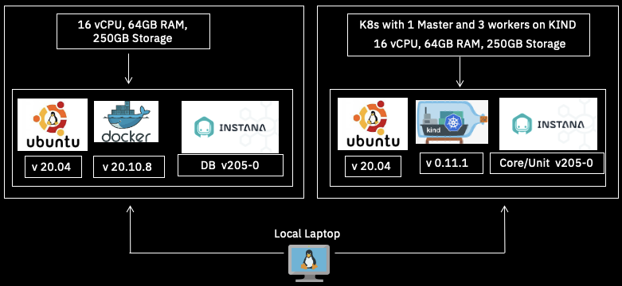
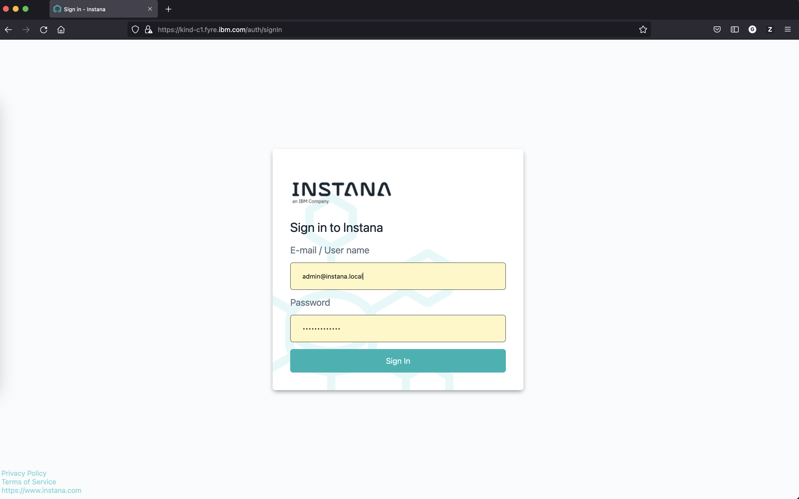
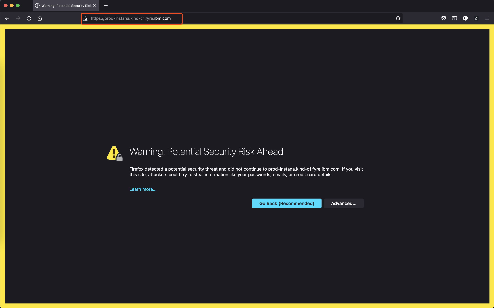
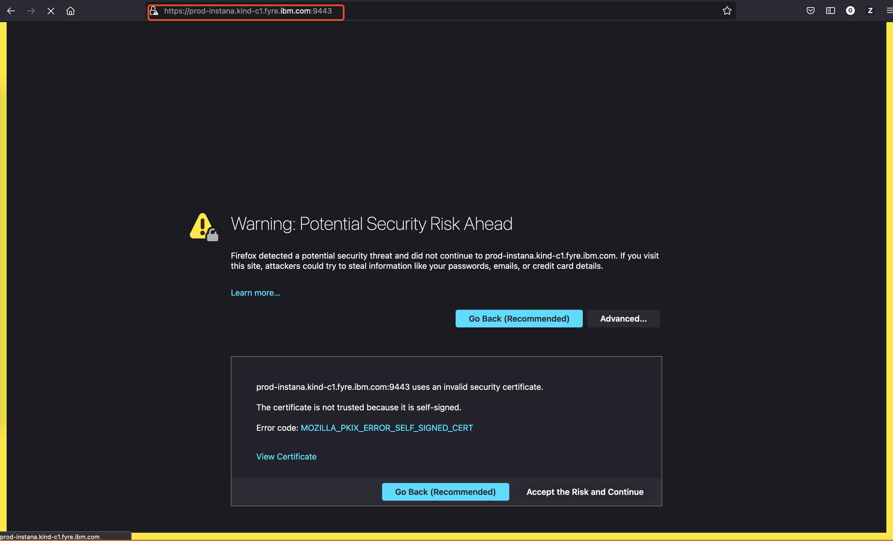
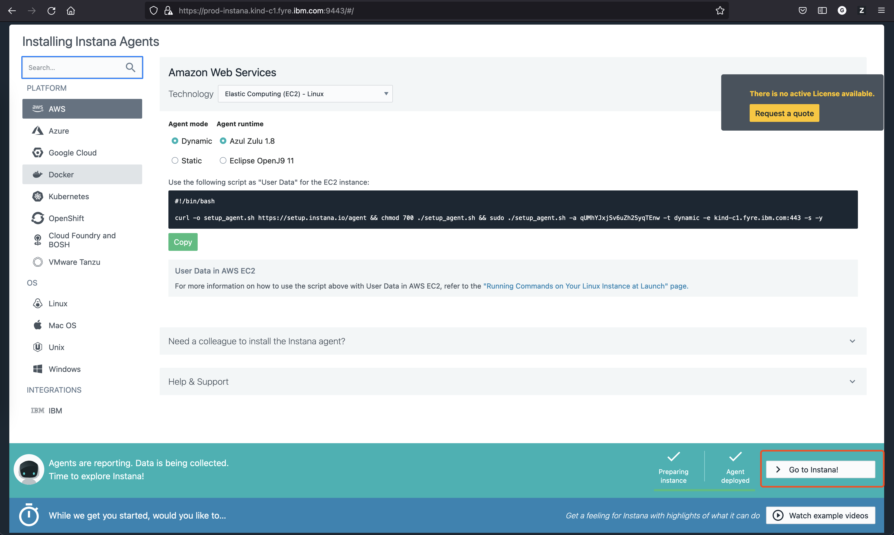
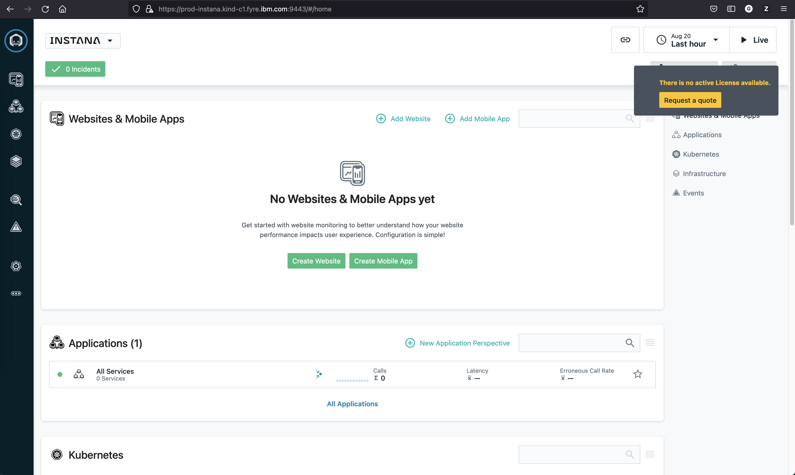

<!-- START doctoc generated TOC please keep comment here to allow auto update -->
<!-- DON'T EDIT THIS SECTION, INSTEAD RE-RUN doctoc TO UPDATE -->
**Table of Contents**  *generated with [DocToc](https://github.com/thlorenz/doctoc)*

- [Setting Instana Running on KIND Cluster](#setting-instana-running-on-kind-cluster)
  - [Prerequisites](#prerequisites)
  - [Install Instana DB on `kind-c2`](#install-instana-db-on-kind-c2)
    - [Install instana-console](#install-instana-console)
    - [Configure db-settings.hcl](#configure-db-settingshcl)
    - [Install DB Containers](#install-db-containers)
    - [Verify all DB Containers are running](#verify-all-db-containers-are-running)
  - [Config NFS Server on `kind-c2`](#config-nfs-server-on-kind-c2)
    - [Install NFS Server](#install-nfs-server)
    - [Create a shared folder](#create-a-shared-folder)
    - [Export the shared folder to NFS Server](#export-the-shared-folder-to-nfs-server)
  - [Install K8S Based Instana on `kind-c1`](#install-k8s-based-instana-on-kind-c1)
    - [Create a KIND Cluster](#create-a-kind-cluster)
    - [Create SSL certificates](#create-ssl-certificates)
    - [Create key and cert for SAML](#create-key-and-cert-for-saml)
    - [Create dhparams](#create-dhparams)
    - [Create a StorageClass for Spans with NFS Server](#create-a-storageclass-for-spans-with-nfs-server)
    - [Create a PVC for Instana Core Spans Volumes](#create-a-pvc-for-instana-core-spans-volumes)
    - [Install Instana kubectl Plugin](#install-instana-kubectl-plugin)
    - [Create the settings.hcl for Instana](#create-the-settingshcl-for-instana)
    - [Get Instana License](#get-instana-license)
    - [Install Instana](#install-instana)
  - [Access Instana](#access-instana)
    - [Create new NodePort Services](#create-new-nodeport-services)
    - [Check all NodePort services are created](#check-all-nodeport-services-are-created)
    - [Access Instana UI](#access-instana-ui)
    - [Setup Apache](#setup-apache)
  - [Using Instana](#using-instana)

<!-- END doctoc generated TOC please keep comment here to allow auto update -->

# Setting Instana Running on KIND Cluster

This is a tutorial for how to install and run Instana on [KIND](https://kind.sigs.k8s.io/) Cluster.

## Prerequisites

- Two Ubuntu VMs with 16 Core, 64G Memory and 250G Disk
- VM should have network access to the internet
- One VM for Instana DB and another VM for Instana runnin on KIND
- The version for different components are as follows:
  - KIND 0.11.1
  - Ubuntu 20.04
  - Docker 20.10.8
  - Instana Build 205
- Have your own `agent_key`, `download_key` and `sales_key`



The above picture shows Instana running on KIND Cluster with those two VMs.

In this tutorial, I will use `kind-c1` and `kind-c2` as the two VMs for Instana DB and Instana running on KIND.

- `kind-c1` will be used for Instana DB
- `kind-c2` will be used for Instana running on KIND

```console
Guangyas-MacBook-Pro:~ guangyaliu$ cat /etc/hosts | grep kind
9.123.116.23 kind-c1 kind-c1.fyre.ibm.com
9.123.116.29 kind-c2 kind-c2.fyre.ibm.com
```

## Install Instana DB on `kind-c2`

This section is get from [Instana Database Setup](https://www.instana.com/docs/self_hosted_instana_k8s/single_host_database).

### Install instana-console

```console
echo "deb [arch=amd64] https://self-hosted.instana.io/apt generic main" > /etc/apt/sources.list.d/instana-product.list
wget -qO - "https://self-hosted.instana.io/signing_key.gpg" | apt-key add -
apt-get update
apt-get install instana-console
```

### Configure db-settings.hcl

This is a template for the `db-setting.hcl`.

```
type      = "single-db"
host_name = "<The-FQDN-of-the-machine-the-datastores-are-installed-on>"

dir {
  metrics    = "/mnt/metrics"  //cassandra data dir
  traces     = "/mnt/traces"   // clickhouse data dir
  data       = "/mnt/data"    // elastic, cockroachdb and kafka data dir
  logs       = "/var/log/instana" //log dir for db's
}

docker_repository {
  base_url = "containers.instana.io"
  username = "_"
  password = "<Your-agent-key>"
}
```

You may want to create `/mnt/metrics`, `/mnt/traces`, `/mnt/data` and `/var/log/instana` directories on `kind-c2` manually.

Here is the exact `db-setting.hcl` on `kind-c2`:

```
type      = "single-db"
host_name = "kind-c2.fyre.ibm.com"

dir {
  metrics    = "/mnt/metrics"  //cassandra data dir
  traces     = "/mnt/traces"   // clickhouse data dir
  data       = "/mnt/data"    // elastic, cockroachdb and kafka data dir
  logs       = "/var/log/instana" //log dir for db's
}

docker_repository {
  base_url = "containers.instana.io"
  username = "_"
  password = "<Your-agent-key>"
}
```

### Install DB Containers

```console
instana datastores init -f /path/to/your/db-settings.hcl
```

Here are more commands for `instana datastores` for your reference:

Stop all database containers

```console
instana datastores stop
```

Start all database containers

```console
instana datastores start
```

Update images to the latest version of instana-console

```console
instana datastores update
```

### Verify all DB Containers are running

After `instana datastores init` finished, you can check the status of all database containers and make sure all DB containers are running.

```console
root@kind-c2:~/instana# docker ps
CONTAINER ID   IMAGE                                                                 COMMAND                  CREATED      STATUS                PORTS     NAMES
379999796b49   containers.instana.io/instana/release/product/elasticsearch7:7.10.2   "/usr/bin/instana-el…"   2 days ago   Up 2 days (healthy)             instana-elastic
e2b0c2ee12d0   containers.instana.io/instana/release/product/cassandra:3.11.10       "/usr/bin/instana-ca…"   2 days ago   Up 2 days (healthy)             instana-cassandra
68b05438458d   containers.instana.io/instana/release/product/clickhouse:21.3.8.76    "/usr/bin/instana-cl…"   2 days ago   Up 2 days (healthy)             instana-clickhouse
a7cf03e46799   containers.instana.io/instana/release/product/cockroachdb:20.1.17     "/usr/bin/instana-co…"   2 days ago   Up 2 days (healthy)             instana-cockroachdb
f0e32eaef2ce   containers.instana.io/instana/release/product/kafka:2.7.1             "/usr/bin/instana-ka…"   2 days ago   Up 2 days (healthy)             instana-kafka
47956730898a   containers.instana.io/instana/release/product/zookeeper:3.6.3         "/usr/bin/instana-zo…"   2 days ago   Up 2 days (healthy)             instana-zookeeper
```

OK, your DB Machine is ready.

## Config NFS Server on `kind-c2`

Instana need to store Spans in either S3 or disk, here I do not have a S3 bucket, so I will use a NFS Server instead and the NFS Server will be set up on `kind-c2`.

### Install NFS Server

```console
sudo apt-get update 
sudo apt install nfs-kernel-server
```

### Create a shared folder

```console
mkdir /mnt/nfs_share
chown nobody:nogroup /mnt/nfs_share # no-one is owner 
chmod 777 /mnt/nfs_share # everyone can modify files
```

### Export the shared folder to NFS Server

Add following to `etc/exports`

```
/mnt/nfs_share *(rw,sync,no_root_squash,no_all_squash)
```

Export and estart NFS Server.

```console
exportfs -a # making the file share available 
systemctl restart nfs-kernel-server # restarting the NFS kernel
```

## Install K8S Based Instana on `kind-c1`

This is get from [Instana K8S Setup](https://www.instana.com/docs/self_hosted_instana_k8s/installation/)


### Create a KIND Cluster

First we need create a Cluster config for KIND withe one Control Plane and three workers as follows. Please note we are enabling `NodePort` for this KIND cluster for future access of Instana.

```yaml
kind: Cluster
apiVersion: kind.x-k8s.io/v1alpha4
nodes:
  - role: control-plane
    image: kindest/node:v1.21.2
    extraPortMappings:
    - containerPort: 30950
      hostPort: 8600
    - containerPort: 30951
      hostPort: 8601
    - containerPort: 30952
      hostPort: 8080
    - containerPort: 30953
      hostPort: 443
    - containerPort: 30954
      hostPort: 9080
    - containerPort: 30955
      hostPort: 9443
    - containerPort: 30956
      hostPort: 9086
    - containerPort: 30957
      hostPort: 9446
  - role: worker
    image: kindest/node:v1.21.2
  - role: worker
    image: kindest/node:v1.21.2
  - role: worker
    image: kindest/node:v1.21.2
```

Save above file as `cluster.yaml` and run the following command to deploy the KIND cluster:

```console
kind create cluster --config cluster.yaml --name instana
```

After the `kind create` finished, check all nodes are ready:

```console
root@kind-c1:~/kind# kubectl get nodes
NAME                    STATUS   ROLES                  AGE     VERSION
instana-control-plane   Ready    control-plane,master   2d21h   v1.21.1
instana-worker          Ready    <none>                 2d21h   v1.21.1
instana-worker2         Ready    <none>                 2d21h   v1.21.1
instana-worker3         Ready    <none>                 2d21h   v1.21.1
```

### Create SSL certificates

Please note, for all of the files that generated and used in this tutorial, I was putting them in one folder named as `instana` on my `kind-c2` node.

The following certificates and key are required for accessing the Instana UI and API.

```console
openssl req -x509 -newkey rsa:2048 -keyout tls.key -out tls.crt -days 365 -nodes -subj "/CN=<hostname>"
```

When configuring the `settings.hcl` the generated files will be referenced from the following entries:
```
tls_crt_path
tls_key_path
```

In my `kind-c1`, I was running following command:

```console
openssl req -x509 -newkey rsa:2048 -keyout tls.key -out tls.crt -days 365 -nodes -subj "/CN=kind-c1.fyre.ibm.com"
```

### Create key and cert for SAML

SAML requires a key to sign/validate messages exchanged with the IDP. The key MUST be encrypted. Unencrypted keys won't be accepted.

- create the key

```
openssl genrsa -aes128 -out saml_key.pem 2048
```

- create the cert
```
openssl req -new -x509 -key saml_key.pem -out saml_cert.pem -days 365
```

- combine them into one PEM
```
cat saml_key.pem saml_cert.pem > saml_key_cert.pem
```

Make sure to store the `saml_key.pem` in a safe location.

When configuring the settings.hcl the generated file and its password will be referenced from the following entries:
```
saml -> pem_location
saml -> pem_password
```

### Create dhparams

`dhparams` is for the file containing Diffie-Hellman params.

```console
openssl dhparam -out dhparams.pem 1024
```

### Create a StorageClass for Spans with NFS Server

We have just created an NFS Server in `kind-c2`, so we need to create a StorageClass for Spans. You need to have `helm` installed on your VM.

```console
root@kind-c1:~/instana# helm version
version.BuildInfo{Version:"v3.3.3", GitCommit:"55e3ca022e40fe200fbc855938995f40b2a68ce0", GitTreeState:"clean", GoVersion:"go1.14.9"}
```

```console
root@kind-c1:~/instana# helm repo add nfs-subdir-external-provisioner https://kubernetes-sigs.github.io/nfs-subdir-external-provisioner/
root@kind-c1:~/instana# helm install nfs-subdir-external-provisioner nfs-subdir-external-provisioner/nfs-subdir-external-provisioner  --set nfs.server=kind-c2.fyre.ibm.com --set nfs.path=/mnt/nfs_share
```

Please make sure update `nfs.server` above to your own NFS Server.

After the above command finished, we can verify if the NFS provisioner is installed and storageclass is created via following command:

```console
root@kind-c1:~/instana# kubectl get po
NAME                                               READY   STATUS    RESTARTS   AGE
nfs-subdir-external-provisioner-78f47cddc9-lbnds   1/1     Running   0          2d20h
```

```console
root@kind-c1:~/instana# kubectl get sc
NAME                 PROVISIONER                                     RECLAIMPOLICY   VOLUMEBINDINGMODE      ALLOWVOLUMEEXPANSION   AGE
nfs-client           cluster.local/nfs-subdir-external-provisioner   Delete          Immediate              true                   2d20h
```

### Create a PVC for Instana Core Spans Volumes

Here is the yaml template that I used to create a PVC for Instana Core Spans.

```yaml
kind: PersistentVolumeClaim
apiVersion: v1
metadata:
  name: spans-volume-claim
  namespace: instana-core
  annotations:
    nfs.io/storage-path: "nfs-share" # not required, depending on whether this annotation was shown in the storage class description
spec:
  storageClassName: nfs-client
  accessModes:
    - ReadWriteMany
  resources:
    requests:
      storage: 10Gi
```

Save above as `nfs-pvc.yaml` and apply it to KIND cluster.

```console
kubectl create ns instana-core
```

```console
kubectl apply -f nfs-pvc.yaml
```

Make sure the pvc is created.

```console
root@kind-c1:~/instana# kubectl get pvc -n instana-core
NAME                 STATUS   VOLUME                                     CAPACITY   ACCESS MODES   STORAGECLASS   AGE
spans-volume-claim   Bound    pvc-f792a6d3-9684-4e0e-b3bd-4eb679a9ab81   10Gi       RWX            nfs-client
```

### Install Instana kubectl Plugin

```
echo "deb [arch=amd64] https://self-hosted.instana.io/apt generic main" > /etc/apt/sources.list.d/instana-product.list
wget -qO - "https://self-hosted.instana.io/signing_key.gpg" | apt-key add -
apt-get update
apt-get install instana-kubectl
```

### Create the settings.hcl for Instana

Here is the template for the settings.hcl file.

```
# <1>
download_key   = "<will_be_sent_to_you>"        # This will be provided to you as part of our licensing flow
sales_key      = "<will_be_sent_to_you>"        # This will be provided to you as part of our licensing flow
base_domain    = "<domain_for_instana>"         # base domain under which the login of instana will be reachable
core_name      = "instana-core"                 # It is possible to run multiple cores, so provide a good name for this installation
profile        = "small"                        # Sizing of instana: small/large/xlagre/xxlarge
admin_password = "<pick_an_initial_password>"   # Password the initial admin user will have
token_secret   = "<random_string>"              # Seed for creating crypto tokens, pick a random 12 char string
dhparams       = "dhparams.pem"                 # File containing Diffie-Hellman params
tls_crt_path   = "tls.crt"                      # SSL Cert used for publicly reachable endpoints of Instana
tls_key_path   = "tls.key"                      # SSL Key used for publicly reachable endpoints of Instana
license        = "license"                      # Location of the downloaded license file 

ingress "agent-ingress" {                      # This block defines the public reachable name where the agents will connect 
  hostname = "another.public.dns.name"
  port     = 8600
}

email {                                        # configure this so instana can send alerts and invites
  user = "<user_name>>"
  password = "<user_password>>"
  host = "<smtp_host_name>"
}

units "prod" {                                 # This block defines a tenant unit named prod associated with the tenant instana
    tenant_name       = "instana"
    initial_agent_key = "<provided>"
    profile           = "small"
}

units "dev" {                                  # This block defines a tenant unit named dev associated with the tenant instana
    tenant_name       = "instana"
    initial_agent_key = "<provided>"
    profile           = "small"
}

features "a_feature" = {                       # Feature flags can be enabled/disabled
    enabled = false                               
}
toggles "toggle_name" = {                      # Toggles are config values that can be overridden
   value = "toggle_value"                         
}

spans_location {                               # Spans can be stored in either s3 or on disk, this is an s3 example
  s3 {
    storage_class           = "STANDARD"
    access_key              = "access_key"
    secret_key              = "secret_key"
    endpoint                = "storage.googleapis.com"
    region                  = "europe-west4"
    bucket                  = "raw-spans"
    prefix                  = "selfhosted"
    storage_class_long_term = "STANDARD"
    bucket_long_term        = "raw-spans"
    prefix_long_term        = "selfhosted"
  }
}

databases "cassandra"{                        # Database definitions, see below the code block for a detailed explanation.
  nodes = ["10.164.0.2"]
}

databases "cockroachdb"{
  nodes = ["10.164.0.2"]
}

databases "clickhouse"{
  nodes = ["10.164.0.2"]
}

databases "elasticsearch"{
  nodes = ["10.164.0.2"]
}

databases "kafka"{
  nodes = ["10.164.0.2"]
}

databases "zookeeper"{
  nodes = ["10.164.0.2"]
}
```

And the following is the `settings.hcl` that I used for my cluster in `kind-c1`.

```
root@kind-c1:~/instana# cat settings.hcl
# <1>
download_key   = "<Your-download-key>"          # This will be provided to you as part of our licensing flow
sales_key      = "<Your-sales-key>"             # This will be provided to you as part of our licensing flow
base_domain    = "kind-c1.fyre.ibm.com"         # base domain under which the login of instana will be reachable
core_name      = "instana-core"                 # It is possible to run multiple cores, so provide a good name for this installation
profile        = "small"                        # Sizing of instana: small/large/xlagre/xxlarge
admin_password = "passw0rd"                # Password the initial admin user will have
token_secret   = "randomstring"                 # Seed for creating crypto tokens, pick a random 12 char string
dhparams       = "dhparams.pem"                 # File containing Diffie-Hellman params
tls_crt_path   = "tls.crt"                      # SSL Cert used for publicly reachable endpoints of Instana
tls_key_path   = "tls.key"                      # SSL Key used for publicly reachable endpoints of Instana
license        = "license"                      # Location of the downloaded license file

ingress "agent-ingress" {                      # This block defines the public reachable name where the agents will connect
  hostname = "kind-c1.fyre.ibm.com"
  port     = 8600
}

email {                                        # configure this so instana can send alerts and invites
  user = "<user_name>>"
  password = "<user_password>>"
  host = "<smtp_host_name>"
}

units "prod" {                                 # This block defines a tenant unit named prod associated with the tenant instana
    tenant_name       = "instana"
    initial_agent_key = "<Your-agent-key>"
    profile           = "small"
}

#units "dev" {                                  # This block defines a tenant unit named dev associated with the tenant instana
#    tenant_name       = "instana"
#    initial_agent_key = "<provided>"
#    profile           = "small"
#}

#features "a_feature" = {                       # Feature flags can be enabled/disabled
#    enabled = false
#}

#toggles "toggle_name" = {                      # Toggles are config values that can be overridden
#   value = "toggle_value"
#}

spans_location {                               # Spans can be stored in either s3 or on disk, this is an s3 example
    persistent_volume {                            # Use a persistent volume for raw-spans persistence
        volume_name = "raw-spans"             # Name of the persisten volume to be used
        storage_class = "nfs-client"           # Storage class to be used
    }
#  s3 {
#    storage_class           = "STANDARD"
#    access_key              = "access_key"
#    secret_key              = "secret_key"
#    endpoint                = "storage.googleapis.com"
#    region                  = "europe-west4"
#    bucket                  = "raw-spans"
#    prefix                  = "selfhosted"
#    storage_class_long_term = "STANDARD"
#    bucket_long_term        = "raw-spans"
#    prefix_long_term        = "selfhosted"
#  }
}

databases "cassandra"{                        # Database definitions, see below the code block for a detailed explanation.
  nodes = ["9.123.116.29"]
}

databases "cockroachdb"{
  nodes = ["9.123.116.29"]
}

databases "clickhouse"{
  nodes = ["9.123.116.29"]
}

databases "elasticsearch"{
  nodes = ["9.123.116.29"]
#  cluster_name = "onprem_onprem"
}

databases "kafka"{
  nodes = ["9.123.116.29"]
}

databases "zookeeper"{
  nodes = ["9.123.116.29"]
}
```

Some highlights of the configuration:
- For all of the DB nodes above, please use the IP of your DB host, for my case I was using IP address of `kind-c2` as `9.123.116.29`.
- I do not have a S3 bucket for raw-spans, so I am using a NFS persistent volume for raw-spans.

### Get Instana License

You also need to get the Instana License for your cluster.

### Install Instana

After above steps finsihed, if you check `instana` folder on `kind-c2`, you will see following files:

```console
root@kind-c1:~/instana# ls
dhparams.pem  license  nfs-pvc.yaml  saml_cert.pem  saml_key.pem  saml_key_cert.pem  settings.hcl  tls.crt  tls.key
```

Then run the following command to install Instana on your KIND cluster on `kind-c1`.

```
kubectl instana apply
```

After the command run, you will be able to see the following output:

```console
root@kind-c1:~/instana# kubectl instana apply
Please make sure the installed databases are at the correct versions:


  * Cassandra:     3.11.10
  * Clickhouse:    21.3.8.76
  * CockroachDB:   20.1.17
  * Elasticsearch: 7.10.2
  * Kafka:         2.7.1
  * Zookeeper:     3.6.3


All set? (y/N)
y
crd cores.instana.io: created
crd units.instana.io: created
namespace instana-operator: applied
namespace instana-core: applied
namespace instana-units: applied
secret instana-secrets in instana-core: created
secret instana-tls-secrets in instana-core: created
secret instana-smtp-secrets in instana-core: created
secret instana-registry in instana-core: created
secret instana-registry in instana-operator: created
service cassandra in instana-core: created
service cockroachdb in instana-core: created
service clickhouse in instana-core: created
service elasticsearch in instana-core: created
service kafka in instana-core: created
service zookeeper in instana-core: created
endpoints cassandra in instana-core: created
endpoints cockroachdb in instana-core: created
endpoints clickhouse in instana-core: created
endpoints elasticsearch in instana-core: created
endpoints kafka in instana-core: created
endpoints zookeeper in instana-core: created
cluster role created: instana-selfhosted-operator
cluster role binding instana-selfhosted-operator in : created
services account: instana-selfhosted-operator created
operator deployment instana-selfhosted-operator in instana-operator: created
network policy instana-selfhosted-operator in instana-operator: created
core instana-core in instana-core: created
unit instana-prod in instana-units: created
```

Wait a while and check if all pods under namespace `instana-operator`, `instana-core` and `instana-units` and  are running well without any crash.

```console
root@kind-c1:~/instana# kubectl get pods -n instana-operator
NAME                                           READY   STATUS    RESTARTS   AGE
instana-selfhosted-operator-7cf4f575d8-httq9   1/1     Running   0          2d21h
```
```console
root@kind-c1:~/instana# kubectl get pods -n instana-core
NAME                                         READY   STATUS    RESTARTS   AGE
acceptor-c6f7556d9-9x6f4                     1/1     Running   0          2d21h
accountant-5ffdb6c59c-9fsxf                  1/1     Running   0          2d21h
appdata-health-processor-765cccb684-25drg    1/1     Running   0          2d21h
appdata-reader-6db9ff474b-l7b4w              1/1     Running   0          2d4h
appdata-writer-5cff6cddb8-2lkmg              1/1     Running   0          2d4h
butler-5f45ddf7db-dnj55                      1/1     Running   0          2d21h
cashier-ingest-54887654b7-n6r9h              1/1     Running   0          2d21h
cashier-rollup-6fdc8ddc47-xxvqn              1/1     Running   0          2d21h
eum-acceptor-78fd4f87b5-jx7vq                1/1     Running   0          2d21h
eum-health-processor-66ffc5d9fb-flhdm        1/1     Running   0          2d21h
eum-processor-575f8d95d-bzl44                1/1     Running   0          2d21h
groundskeeper-6b9d5bc6d6-v9vwm               1/1     Running   0          2d21h
ingress-core-76876d467b-ljsql                1/1     Running   0          2d21h
js-stack-trace-translator-56c7db9685-j8wz6   1/1     Running   0          2d21h
serverless-acceptor-79b9ff98f4-mn5pm         1/1     Running   0          2d21h
sli-evaluator-6979dd97b6-5zp2v               1/1     Running   0          2d21h
```
```console
root@kind-c1:~/instana# kubectl get pods -n instana-units
NAME                                                        READY   STATUS    RESTARTS   AGE
ingress-76dc84b68f-72ljg                                    1/1     Running   0          2d21h
tu-instana-prod-appdata-legacy-converter-7d455b5c4f-rk5m5   1/1     Running   0          2d21h
tu-instana-prod-appdata-processor-bb9ccf9f8-6x67c           1/1     Running   0          2d21h
tu-instana-prod-filler-75686ccb89-xskbm                     1/1     Running   0          2d21h
tu-instana-prod-issue-tracker-5cdd484d4b-rjdg8              1/1     Running   0          2d21h
tu-instana-prod-processor-767bf978d9-8lfpj                  1/1     Running   0          2d21h
tu-instana-prod-ui-backend-7bf678f84b-pg2qp                 1/1     Running   0          2d21h
ui-client-584988db4f-6smsr                                  1/1     Running   0          2d21h
```

## Access Instana

### Create new NodePort Services
Instana [official document](https://www.instana.com/docs/self_hosted_instana_k8s/installation/#setting-up-the-network) is using `loadbalaner` to access Instana. For my case, I was using `NodePort` to access which is more simple for local test. Check [Create a KIND Cluster](#create-a-kind-cluster) to get more detail for the node port mapping.

We need to enable `NodePort` for three services of Instana, including `Acceptor` and `Core Ingress` in namespace `instana-core`, `Unit Ingress` in namespace `instana-units`. 

```console
root@kind-c1:~/instana# kubectl get svc -n instana-core | egrep "acceptor|ingress" | egrep -v "eum|serverless"
acceptor                    ClusterIP      10.96.177.83    <none>           8600/TCP,8601/TCP               2d21h
ingress-core                ClusterIP      10.96.114.11    <none>           8080/TCP,8443/TCP               2d21h
```

```console
root@kind-c1:~/instana# kubectl get svc -n instana-units | grep ingress
ingress                                    ClusterIP      10.96.211.210   <none>                                                     8080/TCP,8443/TCP,8086/TCP,8446/TCP                           2d21h
```

Here I was going to create three new `NodePort` services map to above three servies. The following is the YAML file you can apply to your cluster to create those new services.

```yaml
apiVersion: v1
kind: Service
metadata:
  name: acceptor-svc
  namespace: instana-core
spec:
  ports:
    - name: http-service
      port: 8600
      nodePort: 30950
      protocol: TCP
    - name: http-admin
      port: 8601
      nodePort: 30951
      protocol: TCP
  selector:
    application: instana
    component: acceptor
    group: service
  type: NodePort
---
apiVersion: v1
kind: Service
metadata:
  name: ingress-core-svc
  namespace: instana-core
spec:
  ports:
    - name: http
      port: 8080
      nodePort: 30952
      protocol: TCP
    - name: https
      port: 8443
      nodePort: 30953
      protocol: TCP
  selector:
    application: instana
    component: ingress-core
    group: service
  type: NodePort
---
apiVersion: v1
kind: Service
metadata:
  name: unit-ingress-svc
  namespace: instana-units
spec:
  ports:
    - name: http
      port: 8080
      nodePort: 30954
      protocol: TCP
    - name: https
      port: 8443
      nodePort: 30955
      protocol: TCP
    - name: http-eum
      port: 8086
      nodePort: 30956
      protocol: TCP
    - name: https-eum
      port: 8446
      nodePort: 30957
      protocol: TCP
  selector:
    application: instana
    component: ingress
    group: service
  type: NodePort
```

### Check all NodePort services are created

```console
root@kind-c1:~/kind# kubectl get svc -A | grep NodePort
instana-core    acceptor-svc                               NodePort       10.96.184.79    <none>                                                     8600:30950/TCP,8601:30951/TCP                                 12m
instana-core    ingress-core-svc                           NodePort       10.96.148.253   <none>                                                     8080:30952/TCP,8443:30953/TCP                                 12m
instana-units   unit-ingress-svc                           NodePort       10.96.160.118   <none>                                                     8080:30954/TCP,8443:30955/TCP,8086:30956/TCP,8446:30957/TCP   12m
```

### Access Instana UI

Login to the Instan UI via `https://<Your Host>:443`, here `<Your Host>` is `kind-c1.fyre.ibm.com` in my cluster.

- `User name` is `admin@instana.local` by default
- `Passowrd` is `<settings.hcl-admin_password>`, here `password` is `passw0rd` for my cluster.



After click `Sign In`, you will be navigated to the Instan UI as follows, please note the URL has been changed to the format of `<unit-name>-<tenant-name>.<base_domain>`.



Because the KIND `NodePort` is mainly for test, so here we need to update the URL a bit by adding `9443` to the end.



Then you will be able to see Instana UI:



Click `Go to Instana!`, you will be navigated to the Instan main UI as follows:



### Setup Apache

In order to avoid keeping adding the port when accessing Instana UI, you need a proxy sitting in front of KIND and forward incoming traffic to Instana inside KIND via the nodeports. Here we use Apache as an example.

Install apache2:
```console
apt-get update
apt-get install apache2

```

Add below configuration file to `/etc/apache2/sites-available/instana-ssl.conf`:

```
<IfModule mod_ssl.c>
	<VirtualHost *:443>
		ServerName prod-instana.${INSTANA_HOST}
		SSLEngine on
		SSLProxyEngine On
		ProxyRequests Off
		SSLProxyCheckPeerName off
		ProxyPreserveHost On
		SSLCertificateFile path/to/tls.crt
		SSLCertificateKeyFile path/to/tls.key
		ProxyPass / https://prod-instana.${INSTANA_HOST}:9443/
		ProxyPassReverse / https://prod-instana.${INSTANA_HOST}:9443/
	</VirtualHost>

	<VirtualHost *:443>
		ServerName @@INSTANA_HOST
		SSLEngine on
		SSLProxyEngine On
		ProxyRequests Off
		SSLProxyCheckPeerName off
		ProxyPreserveHost On
		SSLCertificateFile path/to/tls.crt
		SSLCertificateKeyFile path/to/tls.key
		ProxyPass / https://${INSTANA_HOST}:8443/
		ProxyPassReverse / https://${INSTANA_HOST}:8443/
	</VirtualHost>
</IfModule>
```

Note:

- INSTANA_HOST is the hostname that hosts your KIND cluster.
- path/to/tls.crt and path/to/tls.key is the certificate that you created in [Create SSL certificates](#create-ssl-certificates).

Then run below commands to enable the configuration:

```console
# enable the site configuration for Instana
a2ensite instana-ssl

# enable the apache modules needed
a2enmod proxy
a2enmod proxy_http
a2enmod ssl

# restart apache service
service apache2 restart
```

Now you should be able to access Instana UI without adding any additional port, because all endpoints will use the default HTTPS port 443.

## Using Instana

This tutorial explains how to install a dev cluster with KIND. If you want to use Instana, please go to the [official document](https://www.instana.com/docs/using_instana) to get more detail.
